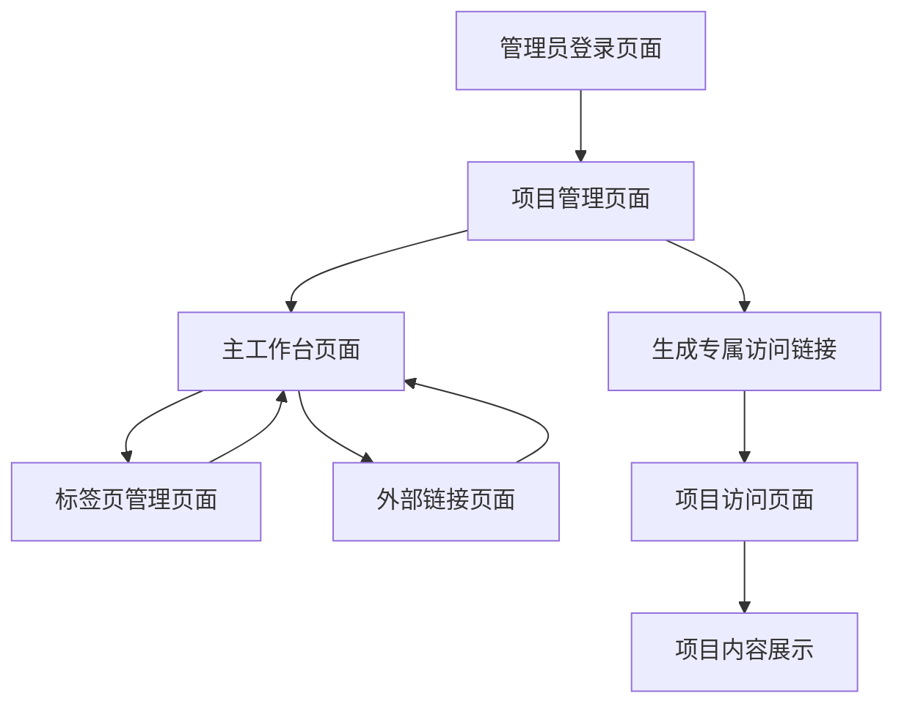

# 团队协作工具产品需求文档

## 1. 产品概述

团队协作工具是一个专注于项目分享和访问的Web应用，通过可自定义的导航标签页系统，让团队成员能够通过分享链接直接访问各类工作资源。

产品旨在解决团队成员在多个工具和文档间频繁切换的痛点，为团队提供统一的资源入口。支持多项目管理，每个项目可独立配置和通过专属链接分享访问。

目标是成为团队资源分享的核心平台，提升团队协作效率，同时提供便捷的项目访问和可选的密码保护功能。

## 2. 核心功能

### 2.1 用户角色

| 角色     | 访问方式     | 核心权限                                    |
| ------ | -------- | --------------------------------------- |
| 系统管理员  | 管理员登录页面  | 创建和管理项目，设置项目密码，生成专属访问链接，管理所有项目内容      |
| 项目访问者  | 专属访问链接访问 | 通过专属链接直接访问项目内容，无需注册，如项目有密码保护需输入密码，可查看和使用项目标签页 |

### 2.2 功能模块

我们的团队协作工具包含以下主要页面：

1. **管理员登录页面**：系统管理员专用登录入口，验证管理员身份
2. **项目管理页面**：创建和管理多个项目，设置项目密码，生成专属访问链接
3. **主工作台页面**：响应式顶部菜单栏、项目切换器、可自定义导航标签页区域、标签页内容展示区域
4. **项目访问页面**：通过专属链接访问项目，支持密码验证，无需注册
5. **标签页管理页面**：标签页列表管理、添加新标签页、编辑标签页设置

### 2.3 页面详情

| 页面名称    | 模块名称     | 功能描述                             |
| ------- | -------- | -------------------------------- |
| 管理员登录页面 | 登录表单     | 管理员身份验证，支持用户名密码登录和Google SSO登录，只有管理员可见此页面 |
| 管理员登录页面 | Google SSO | 集成Google登录按钮，支持OAuth 2.0认证，新管理员可通过Google账户注册 |
| 管理员登录页面 | 错误处理     | 提供清晰的错误提示和用户引导，包含网络错误、认证失败等场景处理 |
| 项目管理页面  | 项目列表     | 显示所有项目，支持创建、编辑、删除项目操作            |
| 项目管理页面  | 项目设置     | 配置项目名称、描述、密码保护、生成专属访问链接          |
| 项目管理页面  | 访问链接管理   | 生成和管理项目专属访问链接，支持链接复制和分享          |
| 主工作台页面  | 响应式顶部菜单栏 | 显示项目名称、项目切换器、用户头像、设置入口，支持移动端自适应布局 |
| 主工作台页面  | 项目切换器    | 下拉菜单显示所有项目，支持快速切换不同项目            |
| 主工作台页面  | 导航标签页区域  | 展示当前项目的所有标签页，支持点击切换、拖拽排序、右键菜单操作  |
| 主工作台页面  | 内容展示区域   | 通过iframe嵌入外部链接内容，支持飞书文档、原型图等各类链接 |
| 项目访问页面  | 密码验证     | 如项目设置密码保护，显示密码输入框进行验证，无需注册流程     |
| 项目访问页面  | 导航栏布局    | 左侧显示项目名称（${project_name}），中间水平排列标签页，右侧显示下拉按钮（标签页过多时） |
| 项目访问页面  | 标签页导航    | 水平排列显示所有标签页，支持点击切换，超出宽度时自动收缩到下拉菜单 |
| 项目访问页面  | 项目内容     | 验证通过后显示项目的标签页和内容，与主工作台页面类似       |
| 标签页管理页面 | 标签页列表    | 显示当前项目的所有标签页，支持编辑名称、修改链接、删除操作    |
| 标签页管理页面 | 添加标签页    | 提供表单添加新标签页，支持自定义名称和链接地址          |
| 标签页管理页面 | 快速模板     | 提供飞书文档、原型图等常用链接类型的快速添加模板         |

## 3. 核心流程

**系统管理员流程：**
管理员登录（用户名密码或Google SSO） → 创建项目 → 配置项目标签页（飞书文档、原型图等） → 设置项目密码（可选） → 生成专属访问链接 → 分享链接给团队成员

**Google SSO注册流程：**
新管理员点击Google登录 → Google OAuth认证 → 系统验证管理员权限 → 自动创建管理员账户 → 进入项目管理界面

**项目访问者流程：**
点击专属访问链接 → 输入项目密码（如有设置） → 直接查看项目标签页 → 点击标签页快速访问资源（无需注册）

## 4. 用户界面设计

### 4.1 设计风格

* **主色调**：#2563EB（现代蓝）、#F8FAFC（浅灰背景）

* **辅助色**：#10B981（成功绿）、#EF4444（警告红）、#6B7280（文字灰）

* **按钮样式**：圆角8px，悬停时轻微阴影效果

* **字体**：系统默认字体栈，标题16-20px，正文14px，小字12px

* **布局风格**：卡片式设计，顶部固定导航，左右布局适配

* **图标风格**：线性图标，统一使用Heroicons或类似图标库

### 4.2 页面设计概览

| 页面名称    | 模块名称     | UI元素                                |
| ------- | -------- | ----------------------------------- |
| 管理员登录页面 | 登录表单     | 居中卡片布局，用户名密码输入框，登录按钮，简洁的品牌标识      |
| 管理员登录页面 | Google SSO | Google登录按钮，白色背景，Google图标+文字，悬停效果，分隔线"或"字样 |
| 管理员登录页面 | 错误提示     | 红色错误信息框，友好的错误文案，重试按钮，加载状态指示器     |
| 项目管理页面  | 项目列表     | 网格布局项目卡片，每个卡片显示项目名称、描述、操作按钮        |
| 项目管理页面  | 项目设置     | 表单布局，项目信息输入框，密码保护开关，链接生成按钮         |
| 项目管理页面  | 访问链接管理   | 链接展示区域，复制按钮，二维码生成，分享选项             |
| 主工作台页面  | 响应式顶部菜单栏 | 深色背景#1F2937，白色文字，项目切换下拉菜单，右侧用户头像下拉菜单，移动端汉堡菜单 |
| 主工作台页面  | 项目切换器    | 下拉选择器，显示项目名称和图标，支持搜索过滤             |
| 主工作台页面  | 导航标签页区域  | 水平滚动标签页，激活状态蓝色底色，支持拖拽的视觉反馈          |
| 主工作台页面  | 内容展示区域   | 全屏iframe容器，加载状态显示，错误页面友好提示          |
| 项目访问页面  | 密码验证     | 居中密码输入框，验证按钮，项目名称显示，错误提示信息         |
| 项目访问页面  | 导航栏设计    | 固定高度64px，深色背景#1F2937，左侧项目名称16px字体，中间标签页14px字体，右侧下拉按钮 |
| 项目访问页面  | 标签页交互    | 激活状态蓝色底色#2563EB，悬停效果，下拉菜单最多显示10个标签页，支持滚动 |
| 项目访问页面  | 项目内容     | 与主工作台页面相同的布局和样式，但无管理功能             |
| 标签页管理页面 | 标签页列表    | 卡片式布局，每个标签页显示名称、链接、操作按钮             |
| 标签页管理页面 | 添加表单     | 模态框形式，包含名称输入框、链接输入框、类型选择器           |
| 团队设置页面  | 设置面板     | 左侧导航菜单，右侧内容区域，表单样式统一                |

### 4.3 响应式设计

产品采用移动端优先的响应式设计策略，支持桌面端、平板端和移动端的完美适配。

* **桌面端（≥1024px）**：完整功能展示，导航栏显示项目名称+水平标签页+下拉按钮，支持拖拽操作

* **平板端（768px-1023px）**：适配触摸操作，导航栏自动调整标签页数量，超出部分收缩到下拉菜单

* **移动端（<768px）**：导航栏显示项目名称+汉堡菜单按钮，点击展开所有标签页列表，垂直布局，触摸友好的按钮尺寸

### 4.4 Google SSO设计规范

* **登录按钮设计**：白色背景，深灰色边框#D1D5DB，Google彩色图标，"使用Google登录"文字，圆角8px

* **按钮状态**：默认状态白色背景，悬停时浅灰色背景#F9FAFB，点击时显示加载动画

* **布局排列**：传统登录表单在上方，分隔线"或"居中显示，Google登录按钮在下方

* **错误处理**：网络错误显示"网络连接失败，请重试"，认证失败显示"登录失败，请检查账户权限"

* **加载状态**：按钮显示旋转图标，禁用点击，文字变为"正在登录..."

### 4.5 导航栏交互规范

* **标签页溢出处理**：当标签页总宽度超过可用空间时，优先显示前N个标签页，剩余标签页收缩到右侧下拉菜单

* **下拉菜单行为**：点击下拉按钮展开菜单，最多显示10个标签页，超出时支持垂直滚动，点击外部区域自动收起

* **标签页状态**：当前激活标签页显示蓝色底色#2563EB，未激活标签页显示透明背景，悬停时显示浅灰色背景#374151

* **项目名称显示**：左侧项目名称最大宽度200px，超出时显示省略号，支持悬停显示完整名称的工具提示

