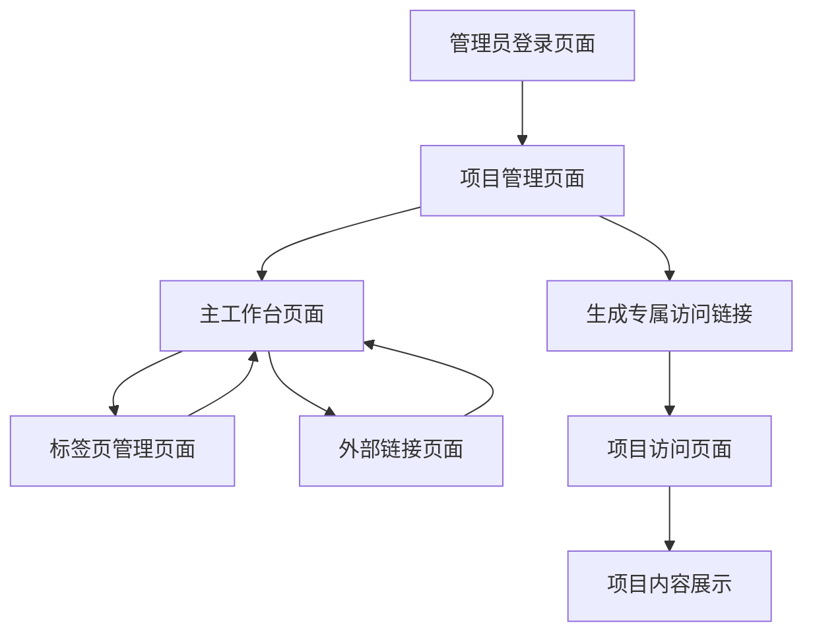

# 团队协作工具产品需求文档

## 1. 产品概述

团队协作工具是一个专注于项目分享和访问的Web应用，通过可自定义的导航标签页系统，让团队成员能够通过分享链接直接访问各类工作资源。

产品旨在解决团队成员在多个工具和文档间频繁切换的痛点，为团队提供统一的资源入口。支持多项目管理，每个项目可独立配置和通过专属链接分享访问。

目标是成为团队资源分享的核心平台，提升团队协作效率，同时提供便捷的项目访问和可选的密码保护功能。

## 2. 核心功能

### 2.1 设计系统与UI组件库

本项目**严格遵循shadcn/ui官方原生设计规范**，完全采用shadcn/ui组件库的默认样式、布局和交互行为，不进行任何自定义修改。

**shadcn/ui官方设计理念：**
- **原生设计标准**：严格按照shadcn/ui官方文档的设计标准实现
- **默认样式优先**：使用组件库的原生默认样式，不添加自定义样式覆盖
- **官方交互行为**：保持shadcn/ui组件的原生交互逻辑和用户体验
- **标准化实现**：遵循官方示例代码和最佳实践指南
- **无障碍访问**：继承shadcn/ui内置的完整可访问性支持
- **一致性保证**：确保所有组件使用方式与官方文档完全一致

**项目中使用的主要shadcn/ui组件：**
- **Button**：各类操作按钮，支持多种变体（default、destructive、outline、secondary、ghost、link）
- **Card**：项目卡片、内容容器等布局组件
- **Avatar**：用户头像显示，支持图片和文字回退
- **Toast**：操作反馈提示，如复制成功、错误提示等
- **Dialog**：模态框，用于项目设置、确认操作等
- **Input**：表单输入框，支持各种输入类型
- **DropdownMenu**：下拉菜单，用于项目切换、用户操作等
- **Tabs**：标签页组件，核心导航功能
- **Badge**：状态标识和标签显示

### 2.2 用户角色

| 角色     | 访问方式     | 核心权限                                    |
| ------ | -------- | --------------------------------------- |
| 系统管理员  | 管理员登录页面  | 创建和管理项目，设置项目密码，生成专属访问链接，管理所有项目内容      |
| 项目访问者  | 专属访问链接访问 | 通过专属链接直接访问项目内容，无需注册，如项目有密码保护需输入密码，可查看和使用项目标签页 |

### 2.3 功能模块

我们的团队协作工具包含以下主要页面，**严格采用shadcn/ui官方原生组件构建**：

1. **管理员登录页面**：系统管理员专用登录入口，验证管理员身份，**完全使用shadcn/ui原生Card、Input、Button组件的默认样式和交互**
2. **项目管理页面**：创建和管理多个项目，设置项目密码，生成专属访问链接，**严格采用shadcn/ui原生Card布局和Dialog模态框的官方实现**
3. **主工作台页面**：响应式顶部菜单栏、项目切换器、可自定义导航标签页区域、标签页内容展示区域，**完全集成shadcn/ui原生DropdownMenu和Tabs组件的默认行为**
4. **项目访问页面**：通过专属链接访问项目，支持密码验证，无需注册，**使用shadcn/ui原生导航栏和标签页组件的官方样式**
5. **标签页管理页面**：标签页列表管理、添加新标签页、编辑标签页设置，**采用shadcn/ui原生Card列表和Toast反馈的默认实现**

### 2.4 页面详情

| 页面名称    | 模块名称     | 功能描述                             |
| ------- | -------- | -------------------------------- |
| 管理员登录页面 | 登录表单     | 管理员身份验证，支持用户名密码登录和Google SSO登录，只有管理员可见此页面 |
| 管理员登录页面 | Google SSO | 集成Google登录按钮，支持OAuth 2.0认证，新管理员可通过Google账户注册 |
| 管理员登录页面 | 错误处理     | 提供清晰的错误提示和用户引导，包含网络错误、认证失败等场景处理 |
| 项目管理页面  | 项目列表     | 显示所有项目，支持创建、编辑、删除项目操作            |
| 项目管理页面  | 项目设置     | 配置项目名称、描述、密码保护、生成专属访问链接          |
| 项目管理页面  | 访问链接管理   | 生成和管理项目专属访问链接，支持链接复制和分享          |
| 主工作台页面  | 响应式顶部菜单栏 | 显示项目名称、项目切换器、用户头像、设置入口，支持移动端自适应布局 |
| 主工作台页面  | 项目切换器    | 下拉菜单显示所有项目，支持快速切换不同项目            |
| 主工作台页面  | 导航标签页区域  | 展示当前项目的所有标签页，支持点击切换、拖拽排序、右键菜单操作  |
| 主工作台页面  | 内容展示区域   | 通过iframe嵌入外部链接内容，支持飞书文档、原型图等各类链接 |
| 项目访问页面  | 密码验证     | 如项目设置密码保护，显示密码输入框进行验证，无需注册流程     |
| 项目访问页面  | 导航栏布局    | 左侧显示项目名称（${project_name}），中间水平排列标签页，右侧显示下拉按钮（标签页过多时） |
| 项目访问页面  | 标签页导航    | 水平排列显示所有标签页，支持点击切换，超出宽度时自动收缩到下拉菜单 |
| 项目访问页面  | 项目内容     | 验证通过后显示项目的标签页和内容，与主工作台页面类似       |
| 标签页管理页面 | 标签页列表    | 显示当前项目的所有标签页，支持编辑名称、修改链接、删除操作    |
| 标签页管理页面 | 添加标签页    | 提供表单添加新标签页，支持自定义名称和链接地址          |
| 标签页管理页面 | 快速模板     | 提供飞书文档、原型图等常用链接类型的快速添加模板         |

## 3. 核心流程

**系统管理员流程：**
管理员登录（用户名密码或Google SSO） → 创建项目 → 配置项目标签页（飞书文档、原型图等） → 设置项目密码（可选） → 生成专属访问链接 → 分享链接给团队成员

**Google SSO注册流程：**
新管理员点击Google登录 → Google OAuth认证 → 系统验证管理员权限 → 自动创建管理员账户 → 进入项目管理界面

**项目访问者流程：**
点击专属访问链接 → 输入项目密码（如有设置） → 直接查看项目标签页 → 点击标签页快速访问资源（无需注册）

## 4. 用户界面设计

### 4.1 设计风格

**完全采用shadcn/ui官方原生设计规范**，严格遵循官方文档中的所有设计标准和实现方式：

* **官方设计原则**：
  - **原生优先**：使用shadcn/ui组件的默认配置，不进行样式覆盖
  - **标准化实现**：严格按照官方示例代码和API文档实现
  - **一致性保证**：确保所有组件行为与官方文档完全一致

* **shadcn/ui原生颜色系统**：使用官方CSS变量，不进行自定义修改
  - 完全采用shadcn/ui默认主题的颜色配置
  - 使用官方定义的语义化颜色变量（primary、secondary、destructive等）
  - 保持官方推荐的明暗主题切换能力

* **shadcn/ui原生组件样式**：
  - **Button组件**：使用官方定义的所有变体（default、destructive、outline、secondary、ghost、link）
  - **Card组件**：采用官方默认的边框、圆角、阴影样式
  - **Input组件**：使用官方默认的边框、聚焦状态、验证样式
  - **所有组件**：严格遵循官方尺寸规范（sm、default、lg）

* **shadcn/ui原生字体系统**：
  - 使用官方推荐的字体栈配置
  - 采用官方定义的字体大小和字重标准
  - 保持官方的行高和字间距设置

* **shadcn/ui原生间距系统**：
  - 严格使用Tailwind CSS的标准间距值
  - 遵循shadcn/ui组件的默认内外边距设置
  - 保持官方推荐的组件间距规范

* **Lucide React图标系统**（shadcn/ui官方推荐）：
  - 使用官方推荐的图标尺寸标准
  - 保持与shadcn/ui组件的原生集成效果
  - 遵循官方的图标颜色和状态变化规范

### 4.2 页面设计概览

| 页面名称    | 模块名称     | UI元素（基于shadcn/ui原生组件）                                |
| ------- | -------- | ----------------------------------- |
| 管理员登录页面 | 登录表单     | shadcn/ui Card组件居中布局，Input组件（用户名密码），Button组件（登录），品牌标识      |
| 管理员登录页面 | Google SSO | shadcn/ui Button组件（outline变体），Lucide React图标，Separator组件分隔线 |
| 管理员登录页面 | 错误提示     | shadcn/ui Alert组件（destructive变体），友好错误文案，Button组件重试     |
| 项目管理页面  | 项目列表     | shadcn/ui Card组件网格布局，项目信息展示，Button组件操作        |
| 项目管理页面  | 项目设置     | shadcn/ui Dialog组件，Input组件表单，Switch组件密码保护，Button组件操作         |
| 项目管理页面  | 访问链接管理   | shadcn/ui Card组件展示，Button组件复制，Toast组件反馈             |
| 主工作台页面  | 响应式顶部菜单栏 | shadcn/ui原生导航栏样式，DropdownMenu组件项目切换，Avatar组件用户头像 |
| 主工作台页面  | 项目切换器    | shadcn/ui DropdownMenu组件，项目列表展示，搜索过滤功能             |
| 主工作台页面  | 导航标签页区域  | shadcn/ui Tabs组件，原生激活状态样式，拖拽交互反馈          |
| 主工作台页面  | 内容展示区域   | 全屏iframe容器，shadcn/ui Skeleton组件加载状态，Alert组件错误提示          |
| 项目访问页面  | 密码验证     | shadcn/ui Card组件居中，Input组件密码输入，Button组件验证         |
| 项目访问页面  | 导航栏设计    | shadcn/ui原生导航栏高度，项目名称展示，Tabs组件标签页，DropdownMenu组件 |
| 项目访问页面  | 标签页交互    | shadcn/ui Tabs组件原生激活状态，悬停效果，DropdownMenu组件溢出处理 |
| 项目访问页面  | 项目内容     | 与主工作台相同的shadcn/ui组件布局，访客模式功能限制             |
| 标签页管理页面 | 标签页列表    | shadcn/ui Card组件列表布局，Badge组件状态标识，Button组件操作             |
| 标签页管理页面 | 添加表单     | shadcn/ui Dialog组件模态框，Input组件表单，Select组件类型选择           |

### 4.3 响应式设计

产品采用移动端优先的响应式设计策略，支持桌面端、平板端和移动端的完美适配。

* **桌面端（≥1024px）**：完整功能展示，导航栏显示项目名称+水平标签页+下拉按钮，支持拖拽操作

* **平板端（768px-1023px）**：适配触摸操作，导航栏自动调整标签页数量，超出部分收缩到下拉菜单

* **移动端（<768px）**：导航栏显示项目名称+汉堡菜单按钮，点击展开所有标签页列表，垂直布局，触摸友好的按钮尺寸

### 4.4 shadcn/ui原生交互规范

**严格遵循shadcn/ui官方组件的默认交互行为：**

* **Button组件交互**：
  - 使用shadcn/ui Button组件的原生状态变化（默认、悬停、激活、禁用）
  - Google登录按钮采用outline变体，保持官方推荐的样式和交互
  - 加载状态使用shadcn/ui的原生loading状态实现

* **DropdownMenu组件交互**：
  - 完全采用shadcn/ui DropdownMenu的原生展开/收起动画
  - 使用官方默认的定位逻辑和自动关闭行为
  - 保持官方推荐的键盘导航和无障碍访问功能

* **Tabs组件交互**：
  - 使用shadcn/ui Tabs组件的原生激活状态样式
  - 保持官方默认的标签页切换动画和状态管理
  - 采用官方推荐的溢出处理和响应式行为

* **Toast组件反馈**：
  - 使用shadcn/ui Toast组件的原生显示和消失动画
  - 保持官方默认的定位、持续时间和交互行为
  - 采用官方推荐的成功、错误、警告等状态样式

* **Dialog组件交互**：
  - 完全采用shadcn/ui Dialog的原生打开/关闭动画
  - 使用官方默认的遮罩层、焦点管理和键盘交互
  - 保持官方推荐的无障碍访问和用户体验标准

