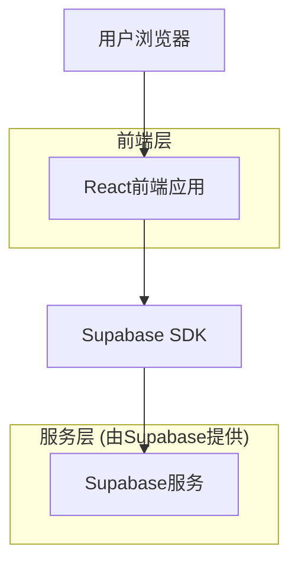
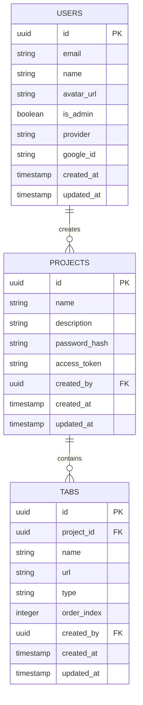

# 团队协作工具技术架构文档

## 1. 架构设计



## 2. 技术描述

* **前端**: React\@18 + TypeScript + Tailwind CSS\@3 + Vite + React DnD

* **后端**: Supabase (认证、数据库、实时订阅)

* **认证服务**: Supabase Auth + Google OAuth 2.0

* **状态管理**: Zustand

* **UI组件**: Headless UI + Heroicons

## 3. 路由定义

| 路由                    | 用途                        |
| --------------------- | ------------------------- |
| /admin/login          | 管理员登录页面，支持用户名密码和Google SSO登录 |
| /admin/projects       | 项目管理页面，创建和管理项目            |
| /project/:id          | 主工作台页面，展示指定项目的导航标签页和内容区域  |
| /access/:token        | 项目访问页面，通过专属链接访问项目         |
| /project/:id/manage   | 标签页管理页面，添加和编辑指定项目的标签页     |
| /login                | 登录页面，用户认证入口               |

## 4. API定义

### 4.1 核心API

**用户认证相关**

```
POST /auth/v1/signup
```

请求:

| 参数名称     | 参数类型   | 是否必需  | 描述    |
| -------- | ------ | ----- | ----- |
| email    | string | true  | 用户邮箱  |
| password | string | true  | 用户密码  |
| metadata | object | false | 用户元数据 |

响应:

| 参数名称    | 参数类型   | 描述     |
| ------- | ------ | ------ |
| user    | object | 用户信息对象 |
| session | object | 会话信息   |

**Google OAuth认证相关**

```
POST /auth/v1/token?grant_type=id_token
```

请求:

| 参数名称     | 参数类型   | 是否必需  | 描述           |
| -------- | ------ | ----- | ------------ |
| id_token | string | true  | Google ID Token |
| provider | string | true  | 固定值"google"   |

响应:

| 参数名称         | 参数类型   | 描述        |
| ------------ | ------ | --------- |
| access_token | string | 访问令牌      |
| refresh_token | string | 刷新令牌      |
| user         | object | 用户信息对象    |
| session      | object | 会话信息      |

```
GET /auth/v1/user
```

响应:

| 参数名称      | 参数类型   | 描述       |
| --------- | ------ | -------- |
| id        | string | 用户ID     |
| email     | string | 用户邮箱     |
| name      | string | 用户姓名     |
| avatar_url | string | 头像URL    |
| is_admin  | boolean | 是否为管理员   |
| provider  | string | 认证提供商    |

**项目管理相关**

```
GET /rest/v1/projects
```

响应:

| 参数名称        | 参数类型   | 描述       |
| ----------- | ------ | -------- |
| id          | string | 项目ID     |
| name        | string | 项目名称     |
| description | string | 项目描述     |
| password    | string | 访问密码     |
| access_token | string | 专属访问令牌   |
| created_by  | string | 创建者ID    |

```
POST /rest/v1/projects
```

请求:

| 参数名称        | 参数类型   | 是否必需  | 描述    |
| ----------- | ------ | ----- | ----- |
| name        | string | true  | 项目名称  |
| description | string | false | 项目描述  |
| password    | string | false | 访问密码  |

```
POST /rest/v1/project-access
```

请求:

| 参数名称     | 参数类型   | 是否必需  | 描述     |
| -------- | ------ | ----- | ------ |
| token    | string | true  | 访问令牌   |
| password | string | false | 项目密码   |

**标签页管理相关**

```
GET /rest/v1/tabs
```

响应:

| 参数名称       | 参数类型   | 描述     |
| ---------- | ------ | ------ |
| id         | string | 标签页ID  |
| name       | string | 标签页名称  |
| url        | string | 外部链接地址 |
| order      | number | 排序序号   |
| project_id | string | 所属项目ID |

```
POST /rest/v1/tabs
```

请求:

| 参数名称       | 参数类型   | 是否必需  | 描述     |
| ---------- | ------ | ----- | ------ |
| name       | string | true  | 标签页名称  |
| url        | string | true  | 外部链接地址 |
| project_id | string | true  | 所属项目ID |
| order      | number | false | 排序序号   |

## 5. 数据模型

### 5.1 数据模型定义



### 5.2 数据定义语言

**用户表 (users)**

```sql
-- 创建用户表
CREATE TABLE users (
  id UUID PRIMARY KEY DEFAULT gen_random_uuid(),
  email VARCHAR(255) UNIQUE NOT NULL,
  name VARCHAR(100) NOT NULL,
  avatar_url TEXT,
  is_admin BOOLEAN DEFAULT FALSE,
  provider VARCHAR(20) DEFAULT 'email' CHECK (provider IN ('email', 'google')),
  google_id VARCHAR(255) UNIQUE,
  created_at TIMESTAMP WITH TIME ZONE DEFAULT NOW(),
  updated_at TIMESTAMP WITH TIME ZONE DEFAULT NOW()
);

-- 创建索引
CREATE INDEX idx_users_email ON users(email);
CREATE INDEX idx_users_is_admin ON users(is_admin);
CREATE INDEX idx_users_provider ON users(provider);
CREATE INDEX idx_users_google_id ON users(google_id);

-- 设置权限
GRANT SELECT ON users TO anon;
GRANT ALL PRIVILEGES ON users TO authenticated;
```

**项目表 (projects)**

```sql
-- 创建项目表
CREATE TABLE projects (
  id UUID PRIMARY KEY DEFAULT gen_random_uuid(),
  name VARCHAR(100) NOT NULL,
  description TEXT,
  password_hash VARCHAR(255),
  access_token VARCHAR(255) UNIQUE NOT NULL DEFAULT encode(gen_random_bytes(32), 'hex'),
  created_by UUID REFERENCES users(id),
  created_at TIMESTAMP WITH TIME ZONE DEFAULT NOW(),
  updated_at TIMESTAMP WITH TIME ZONE DEFAULT NOW()
);

-- 创建索引
CREATE INDEX idx_projects_created_by ON projects(created_by);
CREATE INDEX idx_projects_access_token ON projects(access_token);

-- 设置权限
GRANT SELECT ON projects TO anon;
GRANT ALL PRIVILEGES ON projects TO authenticated;
```


**标签页表 (tabs)**

```sql
-- 创建标签页表
CREATE TABLE tabs (
  id UUID PRIMARY KEY DEFAULT gen_random_uuid(),
  project_id UUID REFERENCES projects(id) ON DELETE CASCADE,
  name VARCHAR(100) NOT NULL,
  url TEXT NOT NULL,
  type VARCHAR(20) DEFAULT 'external' CHECK (type IN ('external', 'feishu', 'prototype')),
  order_index INTEGER DEFAULT 0,
  created_by UUID REFERENCES users(id),
  created_at TIMESTAMP WITH TIME ZONE DEFAULT NOW(),
  updated_at TIMESTAMP WITH TIME ZONE DEFAULT NOW()
);

-- 创建索引
CREATE INDEX idx_tabs_project_id ON tabs(project_id);
CREATE INDEX idx_tabs_project_order ON tabs(project_id, order_index);

-- 设置权限
GRANT SELECT ON tabs TO anon;
GRANT ALL PRIVILEGES ON tabs TO authenticated;

-- 初始化数据
INSERT INTO projects (name, description, created_by)
VALUES ('示例项目', '这是一个示例项目，展示团队协作工具的功能', 'example-admin-id');

INSERT INTO tabs (project_id, name, url, type, order_index, created_by)
VALUES 
  ('example-project-id', '飞书文档', 'https://example.feishu.cn/docs/xxx', 'feishu', 1, 'example-admin-id'),
  ('example-project-id', '原型图', 'https://www.figma.com/file/xxx', 'prototype', 2, 'example-admin-id');
```

## 6. Google OAuth配置

### 6.1 Supabase配置

```sql
-- 在Supabase Dashboard中配置Google OAuth
-- 1. 进入Authentication > Providers
-- 2. 启用Google Provider
-- 3. 配置Google Client ID和Client Secret
-- 4. 设置重定向URL: https://your-project.supabase.co/auth/v1/callback
```

### 6.2 Google Cloud Console配置

```
1. 创建Google Cloud项目
2. 启用Google+ API
3. 创建OAuth 2.0客户端ID
4. 配置授权重定向URI
5. 获取Client ID和Client Secret
```

### 6.3 前端集成示例

```typescript
// Google OAuth登录
const handleGoogleLogin = async () => {
  const { data, error } = await supabase.auth.signInWithOAuth({
    provider: 'google',
    options: {
      redirectTo: `${window.location.origin}/admin/projects`,
      queryParams: {
        access_type: 'offline',
        prompt: 'consent',
      },
    },
  })
  
  if (error) {
    console.error('Google登录失败:', error.message)
  }
}
```

### 6.4 安全最佳实践

* **HTTPS强制**：所有OAuth流程必须使用HTTPS协议
* **状态参数验证**：使用state参数防止CSRF攻击
* **令牌安全存储**：访问令牌存储在HttpOnly Cookie中
* **权限最小化**：只请求必要的Google API权限
* **令牌刷新**：实现自动令牌刷新机制
* **错误处理**：提供友好的错误提示和重试机制
* **管理员验证**：验证Google账户是否具有管理员权限
```

